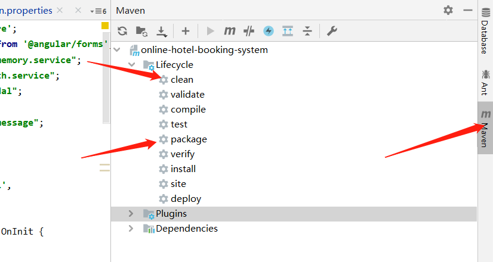
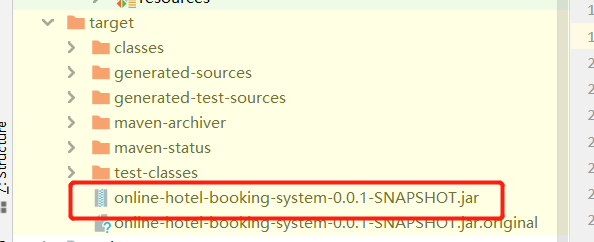

# 项目部署方法

服务器：116.62.54.150  
用户名：root  
密码：xmgl.10035  

## 部署前的准备

### 前端准备
在项目目录下运行：
```shell script
# 进入前端项目文件
cd web
# 编译前端文件，如果前端有修改一定需要重新编译
ng build --prod 
```

### 后端准备
后端需要注意的问题：

+ 编译前请确保spring.properties文件中的配置选项为 prod（必要）
+ 编译前执行maven clean（必要）
+ 执行maven package编译项目


编译成功后会在target目录下产生.jar文件，这个就是我们项目的可执行文件。


## 连接服务器
打开git bash（就是git手动上传的那个软件）

输入命令：
```shell script
ssh root@116.62.54.150
```
成功后就进入服务器了
```shell script
# 进入项目文件夹
cd online-hotel-booking-system/
# 查看Dockerfile，我已经写好了，大家可以看看
cat Dockerfile
# 删除之前的部署文件
rm online-hotel-booking-system-0.0.1-SNAPSHOT.jar
```
进入我们的项目位置，将原来的部署文件删除，方便进行重新部署。

## 上传部署文件

**这里我随便找的一个软件：WinSCP**

此软件安装包之后会发送给大家


上传成功后，就可以准备部署了。

## docker部署

docker部署需要使用基本的docker命令。

部署前请确保之前的文件上传成功。  

第一步也是ssh连接服务器。参照上面的ssh连接服务器的方法连接服务器

在服务器上运行以下命令
```shell script
cd project-based-learning/
# 查看当前运行容器，查找当前容器的id
docker ps
# 关闭当前运行容器
docker stop [容器id]
# 删除当前运行的容器
docker rm [容器id]
# 查看当前镜像文件列表，查找projectbasedlearning的镜像id
docker images
# 删除projectbasedlearning项目的镜像
docker rmi [镜像id]
# 创建新的镜像
docker build -t ohbs .
# 运行镜像，具体参数查找相关文档
docker run -d -p 8080:8080 --name ohbs ohbs

# 可以查看服务器后台状态
docker logs -f -t --tail 500 ohbs
```

之后就可以打开浏览器访问我们的项目了。
http://116.62.54.150:8080/

